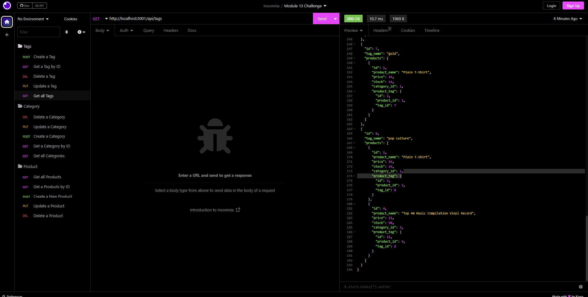

# orm-e-commerce-back-end

[Video Runthrough Link](https://drive.google.com/file/d/1bcMhIFrednYLphhWHS27H3xLS8YDv0fm/view)

## Description
This is a backend application for an E-Commerece site built using Express, Sequelize, and MYSQL databases. The application allows you to view, create, update, and delete all of the sites product's, categories, and tags. Each item is generated an ID which allows the user to target which specefic item they'd like to view, update, or delete. When the user creates a new item it is auto generated an ID.

## Visuals
